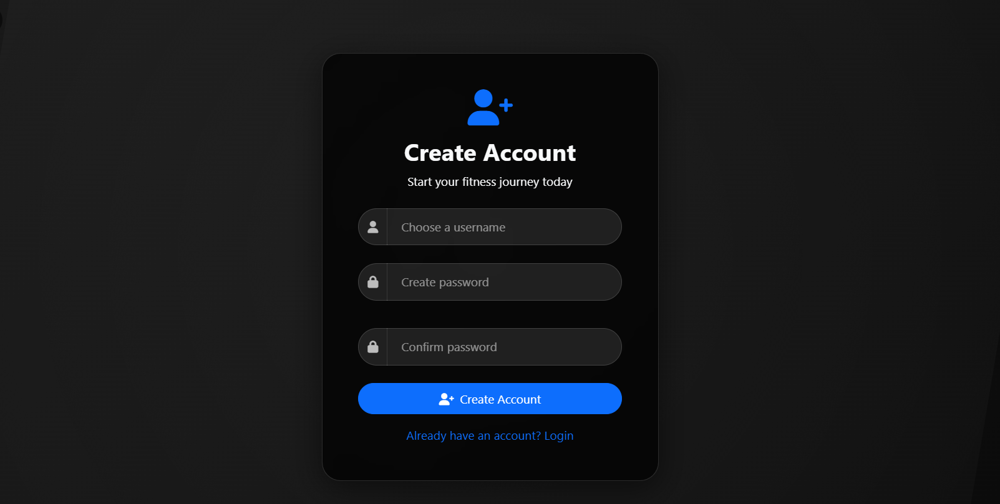
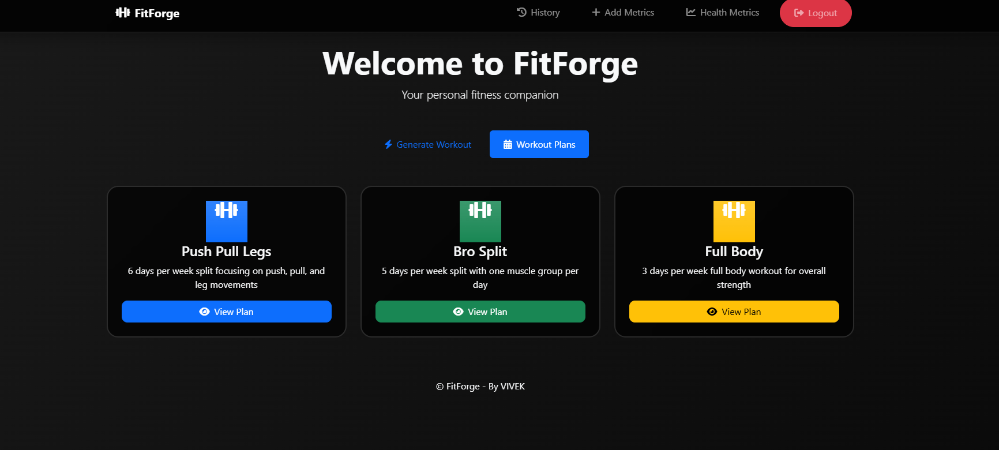
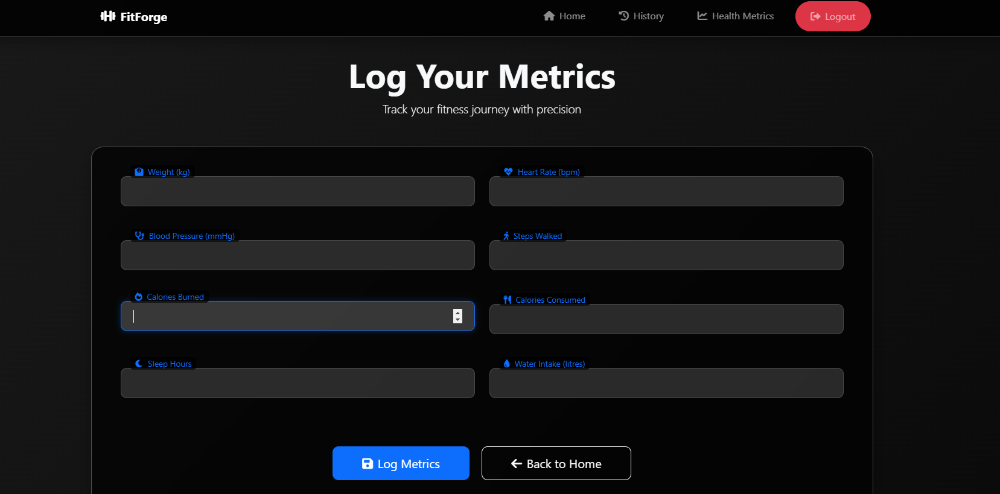

<!-- Animated Header -->
<div align="center">

# FitForge 

[](https://www.python.org/)
[](https://flask.palletsprojects.com/)
[](https://www.mongodb.com/)
[](https://getbootstrap.com/)

_Your Personal AI-Powered Fitness Companion_


</div>

## 🌟 Overview

FitForge revolutionizes your fitness journey by combining cutting-edge AI with personalized workout planning. Whether you're a beginner or a seasoned athlete, our platform adapts to your needs, helping you forge your path to better health.

## ✨ Features

<div align="center">

| Core Feature | Description |
|--------------|-------------|
| 🤖 **AI Workout Generation** | Custom workouts based on your goals and preferences |
| 📊 **Health Metrics** | Comprehensive tracking of calories, steps, and progress |
| 🥗 **Smart Recipe AI** | Personalized meal plans with nutritional insights |
| 📝 **Workout Logger** | Detailed exercise tracking with progress visualization |
| 📈 **Progress Analytics** | 7-day performance tracking with smart insights |
| 🔐 **Secure Platform** | Enterprise-grade user authentication system |

</div>

## 🎯 Smart Features

### Workout Intelligence


### Health Metrics Dashboard
<div align="center">

| Metric | Tracking | Visualization |
|--------|----------|---------------|
| 🔥 Calories | Daily & Weekly | Line Charts |
| 👣 Steps | Real-time | Progress Bars |
| 💪 Workouts | Historical | Heat Maps |
| 🥗 Nutrition | Meal-based | Pie Charts |

</div>

## 📸 Application Showcase

<div align="center">

| Feature | Preview |
|---------|----------|
| 
| **Login Page** |  |
| **Register Page** |  |
| **Home Page** |  |
| **Workout Generator** |  |
| **Workout Plans Page** |  |
| **Workout Plans Page** |  |
| **Workout Logging Page** |  |
| **History Page** |  |
| **Metrics Page** |  |
| **Recipe AI** |  |
| **Progress Tracking** |  |

</div>

## 🛠️ Technology Stack

<div align="center">

| Layer | Technologies |
|-------|--------------|
| **Frontend** |    |
| **Backend** |   |
| **Database** |  |
| **APIs** |   |

</div>

## 🚀 Quick Start

1. **Clone & Setup**
```bash
git clone https://github.com/rimuru2725/FitForge.git
cd fitforge
python -m venv venv
source venv/bin/activate  # Windows: venv\Scripts\activate
```

2. **Install Dependencies**
```bash
pip install -r requirements.txt
```

3. **Environment Setup**
```bash
# Create .env file with your credentials
SECRET_KEY=your_secret_key
MONGODB_URI=your_mongodb_uri
API_NINJAS_KEY=your_api_ninjas_key
SPOONACULAR_API_KEY=your_spoonacular_key
```

4. **Launch**
```bash
python app.py
```

## 🔮 Future Roadmap

<div align="center">

| Feature | Status | Description |
|---------|---------|-------------|
| 🎯 AI Form Correction | Planning | Real-time exercise form feedback |
| 🤝 Social Challenges | In Progress | Community fitness challenges |
| 📱 Mobile App | Planning | Native mobile experience |
| 🧠 Smart Recommendations | In Progress | AI-powered workout adjustments |
| 🌐 Trainer Marketplace | Planning | Connect with fitness professionals |

</div>

## 🤝 Contributing

We welcome fitness enthusiasts and developers! Here's how to contribute:

1. 🍴 Fork the repository
2. 🌿 Create your feature branch (`git checkout -b feature/AmazingFeature`)
3. 💪 Commit your changes (`git commit -m 'Add AmazingFeature'`)
4. 📤 Push to the branch (`git push origin feature/AmazingFeature`)
5. 🎯 Open a Pull Request

## 📧 Contact & Support

<div align="center">

| Channel | Link |
|---------|------|
| 📧 Email | [vivek27082005@gmail.com](mailto:vivek27082005@gmail.com) |
| 💬 Issues | [GitHub Issues](https://github.com/rimuru2725/FitForge/issues) |


</div>

## 📝 License

This project is licensed under the MIT License - see the [LICENSE](LICENSE) file for details.

---

<div align="center">

**Built with 💪 by Vivek**

[⬆ Back to Top](#fitforge)

<sub>Powered by AI and Community Spirit</sub>

</div>