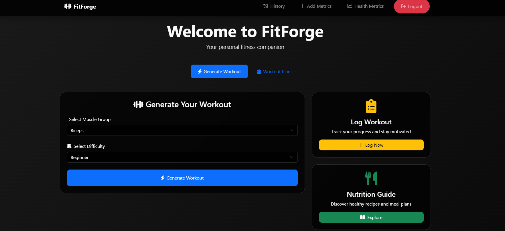
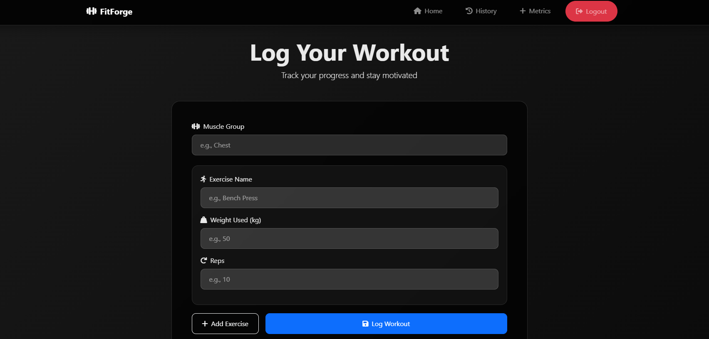
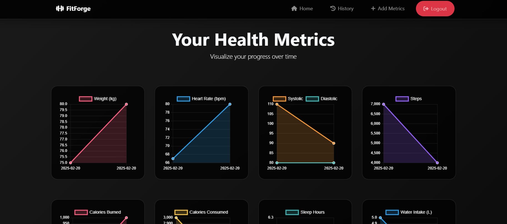

# FitForge 🏋️‍♂️

**FitForge** is a dynamic workout planner designed to provide users with personalized workout plans, track their progress, and log their exercise history—all wrapped in a sleek, dark-themed web application.

---

## 📋 **Features**

1. **Personalized Workout Generator**  
   - Generates custom workout plans based on user input (e.g., muscle group, difficulty).  
   - Fetches exercises dynamically using the **API Ninjas Exercise API**.  

2. **Physical Health Metrics Tracking**  
   - Track your daily physical health metrics (e.g., Calorie consumed, Calorie Burned, Steps walked, etc).  
   - Track them on a weekly basis by vieweing on a line chart.

3. **Personalized Recipe Generation**  
   - Generates  recipes based on ingredients available (e.g., potato, tomato).  
   - Also generates the caloric information about the recipe including the calories and other macros.   
   - Fetches recipes with visuals dynamically using the **Spoonacular API**.  

4. **Workout Logging**  
   - Log details of your workouts, including muscle groups, exercises, weights, and reps.  
   - Update or modify previously logged workouts.  

5. **Workouts Tracking**  
   - Displays logged workouts over the past 7 days .
   - Helps user in Progressive Overloading.  

6. **User Authentication**  
   - Secure login and registration system for personalized user accounts.  

7. **Aesthetic UI/UX**  
   - Dark theme with visually appealing CSS animations.  
   - Clean layout for seamless user experience.  

---

## 🛠️ **Technologies Used**

- **Frontend**: HTML, CSS, JavaScript, Bootstrap 
- **Backend**: Python (Flask Framework)  
- **Database**: MongoDB  
- **API**: API Ninjas Exercise API, Spoonacular API. 

---

## Screenshots

### 1. Welcome Page

### 2. Login Page

### 3. Register Page

### 4. Home Page

### 5. Workout Generator

### 6. Log Workout

### 7. History Page

### 8. Update Workout

### 9. Log Your Physical Metrics Page

### 9. View Your Weekly Metrics Page

### 10. Recipe Generation Page

## 🤝 **Contributing**  
Contributions are always welcome! Feel free to open issues or submit pull requests.  

---

## 📧 **Contact**  
For any queries, reach out to:  
- **VIVEK**: [vivek27082005@gmail.com] 

## 📄 **License**  
This project is licensed under the [MIT License](LICENSE). 