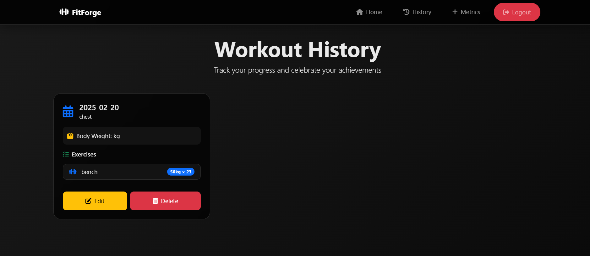

# FitForge 🏋️‍♂️

**FitForge** is a dynamic workout planner designed to provide users with personalized workout plans, track their progress, and log their exercise history—all wrapped in a sleek, dark-themed web application.

---

## 📋 **Features**

1. **Personalized Workout Generator**  
   - Generates custom workout plans based on user input (e.g., muscle group, difficulty).  
   - Fetches exercises dynamically using the **API Ninjas Exercise API**.  

2. **Workout Logging**  
   - Log details of your workouts, including muscle groups, exercises, weights, and reps.  
   - Update or modify previously logged workouts.  

3. **Progress Tracking**  
   - Displays progress through logged workouts over the past 7 days (chart integration planned).  

4. **User Authentication**  
   - Secure login and registration system for personalized user accounts.  

5. **Aesthetic UI/UX**  
   - Dark theme with visually appealing CSS animations.  
   - Clean layout for seamless user experience.  

---

## 🛠️ **Technologies Used**

- **Frontend**: HTML, CSS, JavaScript  
- **Backend**: Python (Flask Framework)  
- **Database**: MongoDB  
- **API**: API Ninjas Exercise API  

---

## Screenshots

### 1. Welcome Page

### 2. Login Page

### 3. Register Page

### 4. Home Page

### 5. Workout Generator

### 6. Log Workout

### 7. History Page

